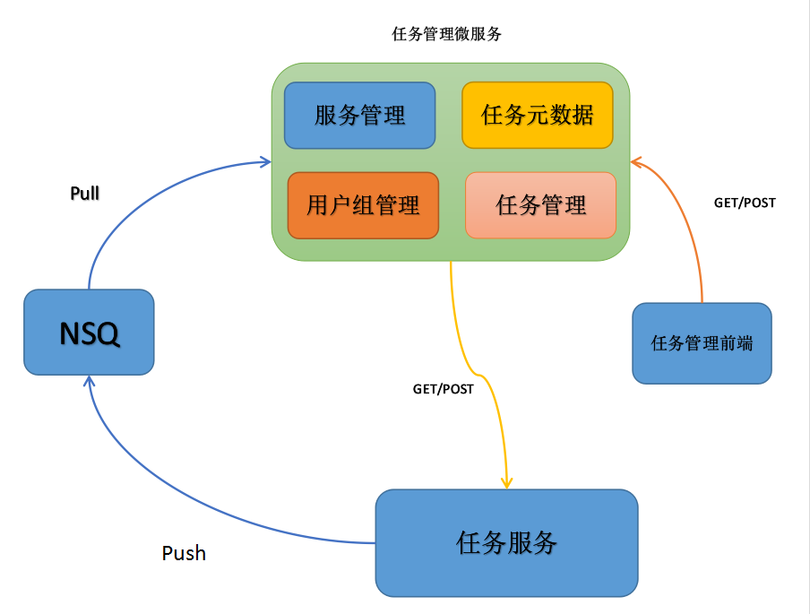

## TaskDash微服务

### 一.架构说明

####1. 与任务服务交互：

任务服务通过push的方式将service信息push到nsq,服务管理模块通过pull的方式从nsq中取出服务信息，进行存储。

    type TaskService struct {
    	URL             string 	`bson:"_id"`            //url
    	Name            string 	`bson:"name"`           //名称
    	Reserved        string 	`bson:"reserved"`       //预留
    }
    
任务服务通过push的方式将心跳信息push到nsq,服务管理模块通过pull的方式从nsq中取出心跳信息进行校验。

    type HeartBeat struct {
    	URL             string 	`bson:"_id"`            //url
    	Time            int64 	`bson:"time"`           //发送心跳的时间
    	Reserved        string 	`bson:"reserved"`       //预留
    }

任务元数据模块通过service信息GET/POST到任务服务，获取任务元数据，然后就行存储。

    type TaskMetadata struct {
    	TaskID          string `bson:"_id"`             //任务id(唯一标识)
    	DataType        string `bson:"type"`            //类别
    	Status          string `bson:"status"`          //任务状态
    	Reserved        string `bson:"reserved"`        //预留
    }
    
####2. 与任务管理前端交互：

任务查询

web前端先进行登录验证，然后通过GET/POST的方式从任务管理服务查询任务信息并显示。

示例：
User：ssx 
前端查询任务返回如下：

| ID   | Name | URL | Description |Status  |Reserved  |
|------|------|-----|-------------|--------|----------|
| 133  | zxf  | ?   | ?           |running |?         |
| 132  | lxq  | ?   | ?           |finish  |?         |
| 131  | lb   | ?   | ?           |shutdown|?         |
| 130  | zgl  | ?   | ?           |restart |?         |
| 137  | zy   | ?   | ?           |running |?         |

用户进行任务领取（权限更高的用户可以进行任务分配），web前端向任务管理服务发送任务分配信息，
任务管理服务将用户ID和任务ID进行绑定然后存储。

    type TaskManagement struct {
    	TaskID          string `bson:"_id"`             //任务id(唯一标识)
    	DataType        string `bson:"type"`            //类别
    	Status          string `bson:"status"`          //任务状态
    	User            string `bson:"user"`            //用户
    	Checker         string `bson:"checker"`         //校验
    	Group           string `bson:"group_id"`        //组
    	Reserved        string `bson:"reserved"`        //预留
    }

### 二.服务发现接口说明

#####1.服务通知
    @title          service_push
    @network        nsq
    @topic:         taskService
    @Body:          json {"url":"http://localhost:8080/rpost/test","name":"abc","type":"2","reserved":"no"}
    
#####2.心跳通知
    @title          heartbeat_push
    @network        nsq 
    @topic:         heartBeat
    @Body:          json {"url":"http://localhost:8080/rpost/test","time":1594885152,"reserved":"no"}

       
### 三.前端接口说明

#####1.1登录

    @title          UserLogin
    @network        post
    @parameter1     operation   :   "userLogin"
    @parameter2     username    :   "abc"
    @parameter2     password    :   "123456"
    @return         string

#####1.2请求示例

    var frameData = {
        "operation":"userLogin",
        "username":VarTool.GetCookie("username"),
        "password":VarTool.GetCookie("password")
    };
            
    var resData = AjaxTool.SendData(frameData,"/rpost/task");
    
#####1.2返回示例

    "success"
    
#####2.1获取任务列表

    @title          GetUnclaimedTasks
    @network        post
    @parameter1     operation   :   "GetUnclaimedTasks"
    @parameter2     status      :   "notget"
    @return         string
    
#####2.2请求示例

    var frameData = {
        "operation":"GetUnclaimedTasks",
        "username":"notget"
    };
            
    var resData = AjaxTool.SendData(frameData,"/rpost/task");
    
#####2.2返回示例    

    [{"TaskID":"sy-hn-0","DataType":"2","Description":"","Status":"notget","Reserved":""},
    {"TaskID":"sy-hn-1","DataType":"2","Description":"","Status":"notget","Reserved":""},
    {"TaskID":"sy-hn-2","DataType":"2","Description":"","Status":"notget","Reserved":""},
    {"TaskID":"sy-hn-3","DataType":"2","Description":"","Status":"notget","Reserved":""},
    {"TaskID":"sy-hn-4","DataType":"2","Description":"","Status":"notget","Reserved":""},
    {"TaskID":"sy-hn-5","DataType":"2","Description":"","Status":"notget","Reserved":""},
    {"TaskID":"sy-hn-6","DataType":"2","Description":"","Status":"notget","Reserved":""},
    {"TaskID":"sy-hn-7","DataType":"2","Description":"","Status":"notget","Reserved":""},
    {"TaskID":"sy-hn-8","DataType":"2","Description":"","Status":"notget","Reserved":""},
    {"TaskID":"sy-hn-9","DataType":"2","Description":"","Status":"notget","Reserved":""},
    {"TaskID":"sy-hn-10","DataType":"2","Description":"","Status":"notget","Reserved":""},
    {"TaskID":"sy-hn-11","DataType":"2","Description":"","Status":"notget","Reserved":""},
    {"TaskID":"sy-hn-12","DataType":"2","Description":"","Status":"notget","Reserved":""},
    {"TaskID":"sy-hn-13","DataType":"2","Description":"","Status":"notget","Reserved":""},
    {"TaskID":"sy-hn-14","DataType":"2","Description":"","Status":"notget","Reserved":""},
    {"TaskID":"sy-hn-15","DataType":"2","Description":"","Status":"notget","Reserved":""},
    {"TaskID":"sy-hn-16","DataType":"2","Description":"","Status":"notget","Reserved":""},
    {"TaskID":"sy-hn-17","DataType":"2","Description":"","Status":"notget","Reserved":""},
    {"TaskID":"sy-hn-18","DataType":"2","Description":"","Status":"notget","Reserved":""},
    {"TaskID":"sy-hn-19","DataType":"2","Description":"","Status":"notget","Reserved":""}]
    
#####3.1获取对应用户下任务列表

    @title          GetUserTasks
    @network        post
    @parameter1     operation   : "GetUserTasks"
    @parameter2     user        : "zhangsan"
    @return         string
    
#####3.2请求示例

    var frameData = {
        "operation":"GetUserTasks",
        "user":"zhangsan"
    };
            
    var resData = AjaxTool.SendData(frameData,"/rpost/task");
    
#####3.2返回示例

    [{"TaskID":"sy-hn-0","DataType":"2","Status":"running","User":"zhangsan","Checker":"lisi","GroupID":"mx","Reserved":""},
    {"TaskID":"sy-hn-1","DataType":"2","Status":"running","User":"zhangsan","Checker":"lisi","GroupID":"mx","Reserved":""},
    {"TaskID":"sy-hn-2","DataType":"2","Status":"running","User":"zhangsan","Checker":"lisi","GroupID":"mx","Reserved":""},
    {"TaskID":"sy-hn-3","DataType":"2","Status":"running","User":"zhangsan","Checker":"lisi","GroupID":"mx","Reserved":""},
    {"TaskID":"sy-hn-4","DataType":"2","Status":"running","User":"zhangsan","Checker":"lisi","GroupID":"mx","Reserved":""},
    {"TaskID":"sy-hn-5","DataType":"2","Status":"running","User":"zhangsan","Checker":"lisi","GroupID":"mx","Reserved":""},
    {"TaskID":"sy-hn-6","DataType":"2","Status":"running","User":"zhangsan","Checker":"lisi","GroupID":"mx","Reserved":""},
    {"TaskID":"sy-hn-7","DataType":"2","Status":"running","User":"zhangsan","Checker":"lisi","GroupID":"mx","Reserved":""},
    {"TaskID":"sy-hn-8","DataType":"2","Status":"running","User":"zhangsan","Checker":"lisi","GroupID":"mx","Reserved":""},
    {"TaskID":"sy-hn-9","DataType":"2","Status":"running","User":"zhangsan","Checker":"lisi","GroupID":"mx","Reserved":""},
    {"TaskID":"sy-hn-10","DataType":"2","Status":"running","User":"zhangsan","Checker":"lisi","GroupID":"mx","Reserved":""},
    {"TaskID":"sy-hn-11","DataType":"2","Status":"running","User":"zhangsan","Checker":"lisi","GroupID":"mx","Reserved":""}]

### 四.错误代码

    "errid":0          "errmsg":"success"
    "errid":1000       "errmsg":"请求格式不正确"
    "errid":1001       "errmsg":"数据库存储失败"
    "errid":1002       "errmsg":"数据库查询失败"